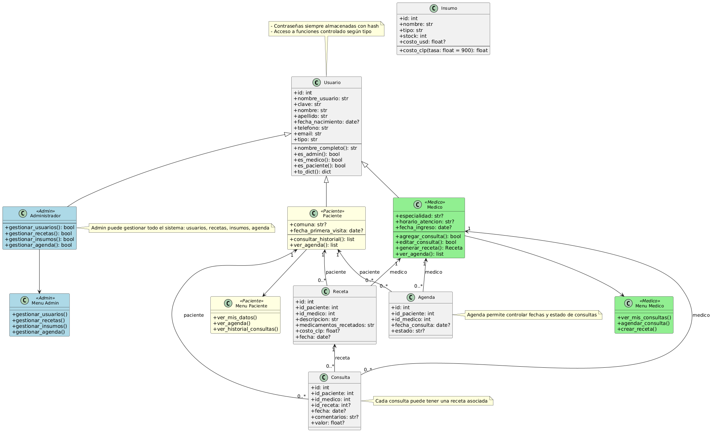

# Proyecto Prototipo MediPlus

## Asignatura
Programación Orientada a Objetos Seguro - Sección 3

## Carrera
Ingeniería en Informática

## Estudiante
Benjamin millalonco

---

## 1. Introduccion
La clinica MediPlus realiza actualmente el registro de pacientes, medicos y consultas en planillas Excel y formularios en papel. Esto genera perdida de información, dificultad para realizar seguimiento de consultas previas y problemas de seguridad debido a la falta de control de acceso.  

El proyecto desarrolla un prototipo de sistema de informacion que permite gestionar usuarios, consultas, recetas, insumos y agenda de manera segura, utilizando bases de datos y autenticación mediante hash de contraseñas.

---

## 2. Objetivo General
Desarrollar un sistema seguro en Python que permita la gestion completa de pacientes, medicos, administradores, consultas, recetas e insumos, asegurando la integridad de los datos y la proteccion de credenciales.

---

## 3. Objetivos Específicos
- Implementar registro de usuarios seguro a partir de archivos JSON.  
- Gestionar inicio de sesión con control de roles (administrador, médico, paciente).  
- Crear menus personalizados según el tipo de usuario.  
- Permitir la edición de información de usuarios y la gestion de recursos medicos.  
- Registrar consultas y recetas asociadas garantizando la integridad referencial.  
- Implementar CRUD para pacientes, medicos, administradores, insumos, recetas y agenda.  
- Prevenir inyeccion SQL mediante consultas parametrizadas.  
- Almacenar toda la información en Oracle XE 21c.  

---

## 4. Requerimientos Detectados
- Gestion de usuarios (crear, leer, actualizar, eliminar).  
- Autenticación segura con hash de contraseñas.  
- Gestion de consultas medicas y recetas.  
- Gestion de insumos medicos.  
- Control de agenda de citas.  
- Presentacion de datos en pesos chilenos (CLP).  
- Restricciones de acceso según tipo de usuario.  
- Registro del trabajo y código en GitHub.  

---

## 5. Diagrama de Clases
Se utilizó PlantUML para representar la estructura del sistema, mostrando herencias, relaciones y métodos principales:

- **Usuario**: Clase base con información común a todos los usuarios.  
- **Paciente, Medico, Administrador**: Heredan de Usuario y añaden atributos especificos.  
- **Receta, Consulta, Insumo, Agenda**: Clases auxiliares que permiten registrar información medica y logistica.  
- **Menus**: Plantillas HTML que muestran opciones según el tipo de usuario.

![Diagrama de Clases MediPlus]

---

## 6. Descripción de la Solucion
El proyecto esta implementado siguiendo el patron MVC:  
- **Modelos**: Definen clases y métodos de negocio para cada entidad.  
- **Controladores**: Gestionan la logica de la aplicacion y el acceso a la base de datos.  
- **Vistas**: Plantillas HTML/CSS que presentan la información y menus según el rol del usuario.  

Se asegura la **seguridad** mediante hash de contraseñas, sesiones controladas y consultas parametrizadas para prevenir inyeccion SQL.  
Se utiliza **Oracle XE 21c** como base de datos relacional y Flask con Blueprints para modularidad.

### Flujo de la aplicacion
1. Registro de usuarios (administrador puede crear cualquier tipo de usuario).  
2. Inicio de sesion según rol.  
3. Menús dinamicos:  
   - Administrador: gestion de usuarios, consultas, recetas e insumos.  
   - Médico: acceso a agenda, consultas y recetas de sus pacientes.  
   - Paciente: acceso a sus consultas y recetas.  
4. CRUD completo para cada entidad.  

Repositorio en GitHub: [https://github.com/tu_usuario/mediplus-backend](https://github.com/HxcCoder/mediplus-backend)

---

## 7. Conclusion
El prototipo MediPlus permite gestionar informacion médica de manera segura y eficiente. Se aplicaron buenas practicas de desarrollo seguro, control de accesos por roles, integridad de datos y almacenamiento confiable. El sistema facilita el seguimiento de consultas, la gestión de recursos y la administracion de usuarios.

---

## 8. Fuentes
- Documentacion de Flask: [https://flask.palletsprojects.com/](https://flask.palletsprojects.com/)  
- Oracle XE 21c: [https://www.oracle.com/database/technologies/xe.html](https://www.oracle.com/database/technologies/xe.html)  
- PlantUML: [https://plantuml.com/es/class-diagram](https://plantuml.com/es/class-diagram)  
- Normas APA para referencias bibliográficas.  
---

